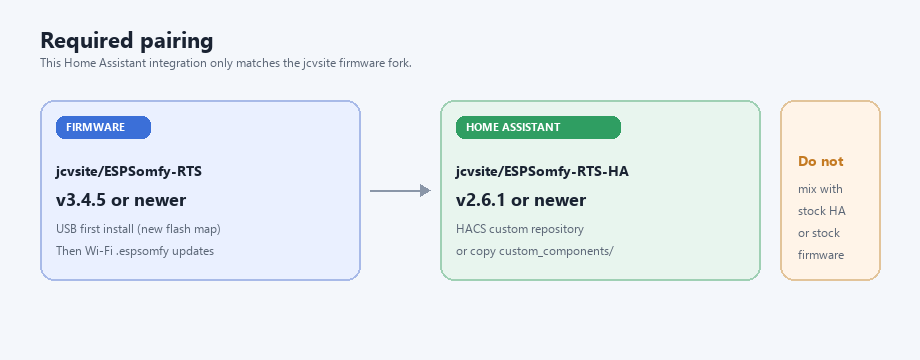
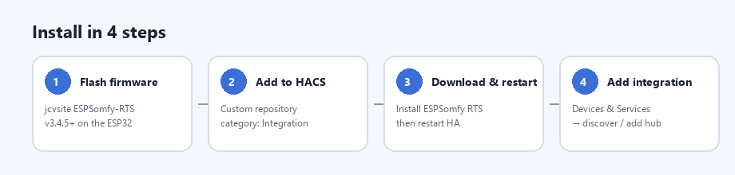
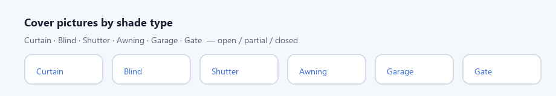

# ESPSomfy RTS — Home Assistant

  

**Home Assistant integration for the [jcvsite/ESPSomfy-RTS](https://github.com/jcvsite/ESPSomfy-RTS) firmware fork.**  
It is **not** a drop-in for stock [rstrouse](https://github.com/rstrouse/ESPSomfy-RTS) firmware — pair both sides of this community stack.

**Current:** integration **v2.6.1** · requires firmware **[jcvsite/ESPSomfy-RTS v3.4.5+](https://github.com/jcvsite/ESPSomfy-RTS)** · [CHANGELOG](CHANGELOG.md)

> **Use together**
> | Component | Repo | Version |
> |---|---|---|
> | Firmware (ESP32) | [jcvsite/ESPSomfy-RTS](https://github.com/jcvsite/ESPSomfy-RTS) | **v3.4.5+** |
> | This integration | [jcvsite/ESPSomfy-RTS-HA](https://github.com/jcvsite/ESPSomfy-RTS-HA) | **v2.6.1+** |
>
> Do **not** mix with stock rstrouse firmware or the stock HA component if you want invert, calibrate, room covers, scenes, cover pictures, or FixedCode switches.

---

## Quick start

### 1. Flash the matching firmware first

1. Install **[jcvsite/ESPSomfy-RTS](https://github.com/jcvsite/ESPSomfy-RTS) v3.4.5+** on your ESP32.  
2. New board or coming from another fork → **USB onboard image** (see the [firmware README](https://github.com/jcvsite/ESPSomfy-RTS#flash-a-new-device)).  
3. Confirm the web UI shows **v3.4.5** (or newer) and that shades are paired.

### 2. Install this integration (HACS)

1. HACS → **⋯** → **Custom repositories**
2. URL: `https://github.com/jcvsite/ESPSomfy-RTS-HA`
3. Category: **Integration**
4. Download **ESPSomfy RTS** → **restart Home Assistant**

### 3. Add the hub

1. **Settings → Devices & Services → Add integration**
2. Search **ESPSomfy RTS** (or accept discovery via mDNS / SSDP)
3. Enter host / login if prompted (same credentials as the device web UI)

### Manual install (without HACS)

Copy `custom_components/espsomfy_rts` into your HA `config/custom_components/` folder, restart, then add the integration as above.

---

## What you get

| | Stock HA (rstrouse) | This fork |
|---|---|---|
| Open / Stop / Close | Yes | Yes |
| Position scale | Motor-native | **100% open / 0% closed** |
| Stop while moving | `my` (may go to favorite) | API **`stop`** (actually stops) |
| Invert / travel / calibrate | Limited / HA-only | **Synced to the ESP** |
| Cover pictures | Generic MDI | Curtain, blind, shutter, awning, garage, gate |
| Entity names | Often `Room-Name` | Device name; room = suggested **area** |
| Room covers | No | **One cover per room** (queued RF) |
| Scenes | No | Service **`apply_scene`** |
| Fixed-code RF switches | No | Learn / TX 433 MHz ON/OFF |
| **Firmware** | Stock ESPSomfy-RTS | **[jcvsite/ESPSomfy-RTS](https://github.com/jcvsite/ESPSomfy-RTS) only** |

Unchanged: mDNS/SSDP discovery, shade/group/sun/dry-contact entities. Upstream services/events: [rstrouse README](https://github.com/rstrouse/ESPSomfy-RTS-HA).

---

## Day-to-day use

### Naming & rooms

- Entity names = **device name** from the controller (not `Room-Shade`).
- Room on the ESP becomes a Home Assistant **suggested area**.
- After renaming or moving rooms on the device, **reload** the integration.

### Covers

Each shade cover has Open / Stop / Close, a position slider, and type-based pictures (open / partial / closed).

**Calibrate position** (Configuration) only corrects the reported % — it does **not** move the motor.

### Buttons never swap

HA always shows **Open / Stop / Close**. Invert changes RF / % on the ESP, not the button labels.

| Symptom | Fix |
|---|---|
| Open closes the shade (and shows “closing”) | Turn on **Invert open/close** |
| % still wrong when fully open/closed | Then **Invert position scale** |

Keep those two settings **independent**. Details and edge cases are below under [Invert & travel times](#invert--travel-times).

### Rooms & scenes

- **Room cover** — Open / Stop / Close for every shade in that room (firmware RF queue).
- Services: `espsomfy_rts.apply_scene`, `espsomfy_rts.room_command`  
  Use `host=` if you have more than one hub.

### RF switches

Learn ON/OFF codes on the **controller web UI**, then **reload** this integration so switch entities appear.

- Unavailable until codes are learned (`ready`)
- Optional: **Invert ON/OFF**, **Single-button remote**
- MQTT discovery can also expose switches without this component — this repo is for the **native** integration

---

## Invert & travel times

Synced config entities on each shade device (after motors are paired in the ESP UI):

| HA entity | ESP field | Purpose |
|---|---|---|
| Invert open/close | `flipCommands` | Swaps RF Up↔Down |
| Invert position scale | `flipPosition` | Fixes 0–100% if still backwards |
| Full open / close time | `upTime` / `downTime` | Travel time (HA seconds ↔ ESP ms) |

**Opening/closing** (direction) and **position %** are separate signals. Fix direction first; only then tweak %.

If the shade is moving when you change a setting, the controller **stops it**, then saves. Somfy UI and HA stay in sync over the WebSocket.

---

## Alexa / voice

- **With Home Assistant (recommended):** expose `cover.*` via HA Cloud Alexa (or a skill), then discover devices. Device class maps to Interior / Exterior Blind.
- **Without HA:** firmware **Network → Alexa** (Hue bridge) — shades appear as lights. Don’t mix Hue bridge and HA Alexa on the same motors. See the [firmware README](https://github.com/jcvsite/ESPSomfy-RTS).

---

## Requirements checklist

- [ ] ESP32 + CC1101 on **[jcvsite/ESPSomfy-RTS](https://github.com/jcvsite/ESPSomfy-RTS) v3.4.5+** (not stock firmware)
- [ ] Home Assistant **2024.6+** (see `hacs.json`)
- [ ] This integration **v2.6.1+** via HACS or manual copy
- [ ] Hub reachable on LAN (REST `:8081`, WebSocket `:8080`)

Hardware wiring & Somfy pairing: [original wiki](https://github.com/rstrouse/ESPSomfy-RTS/wiki).

---

## Links

| | |
|---|---|
| Firmware (required) | https://github.com/jcvsite/ESPSomfy-RTS |
| This integration | https://github.com/jcvsite/ESPSomfy-RTS-HA |
| Upstream HA (stock) | https://github.com/rstrouse/ESPSomfy-RTS-HA |
| Changelog | [CHANGELOG.md](CHANGELOG.md) |
